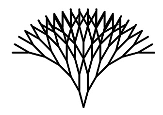
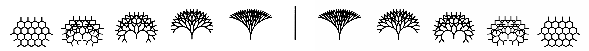
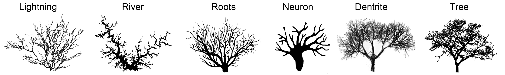
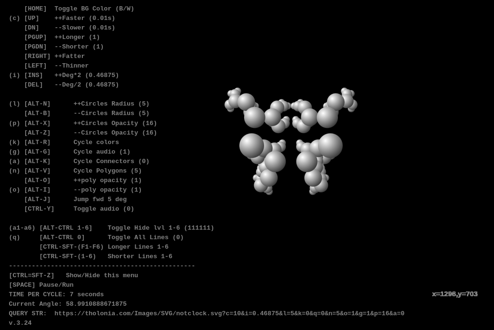
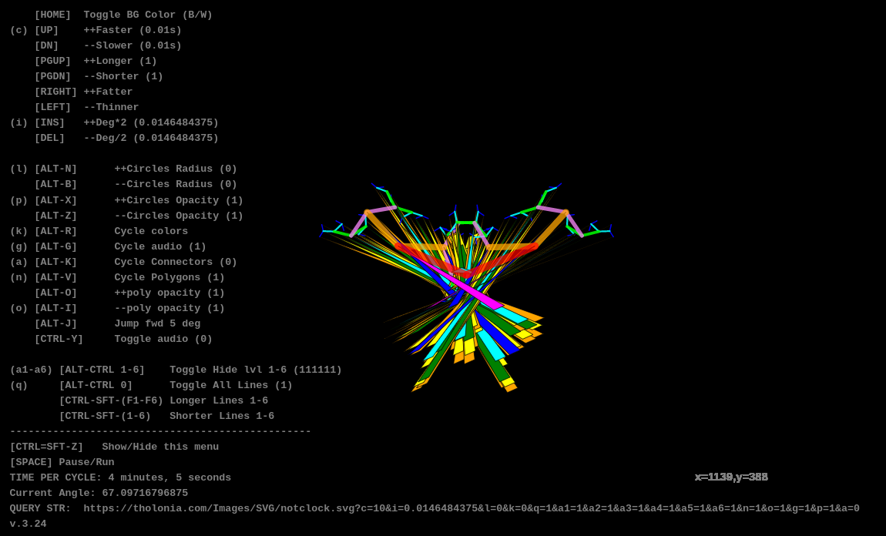
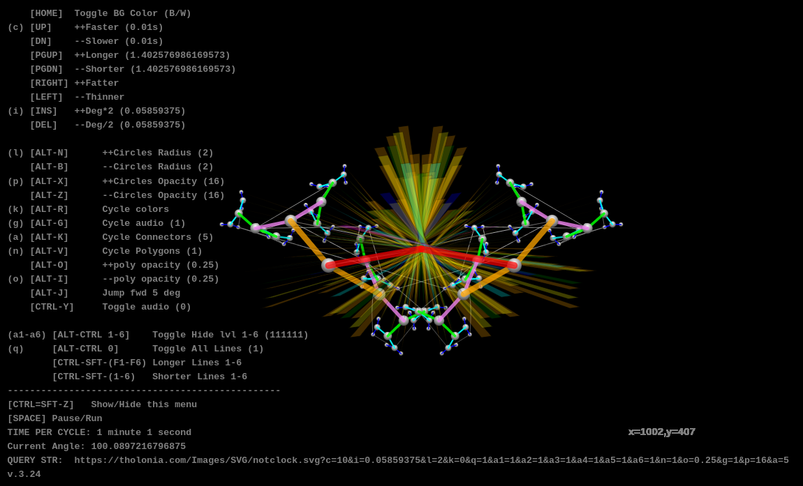
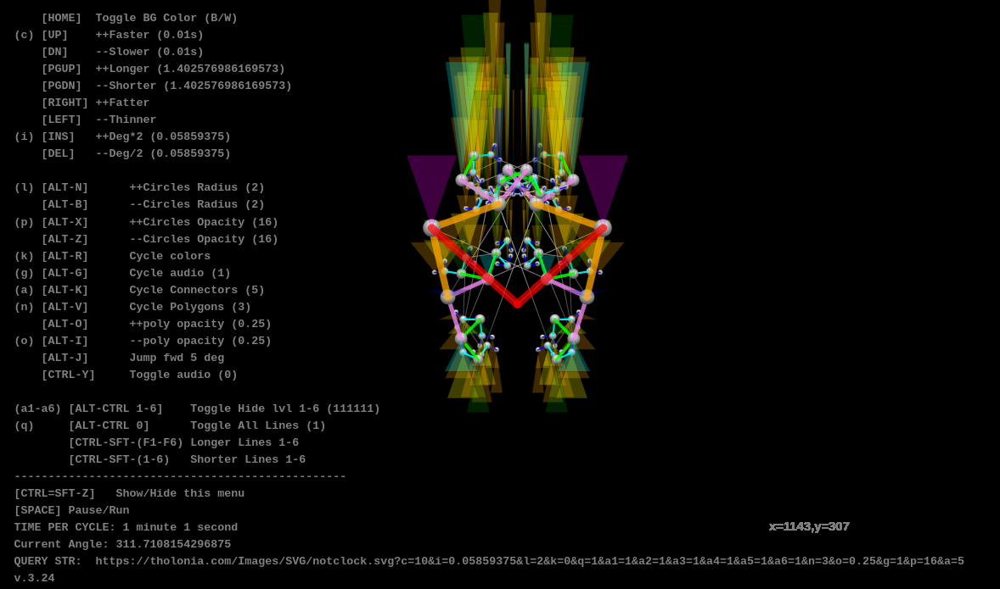
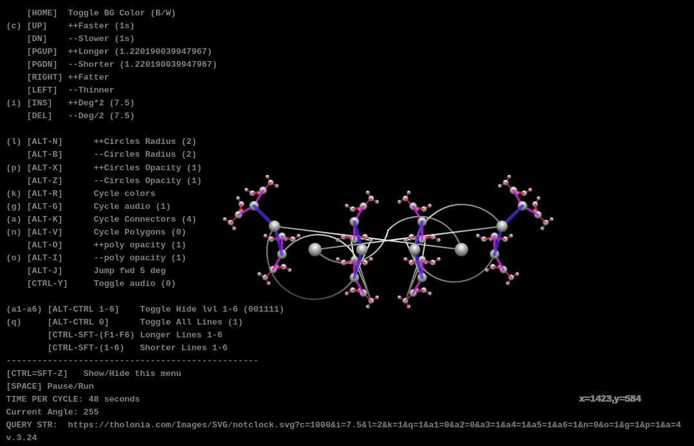
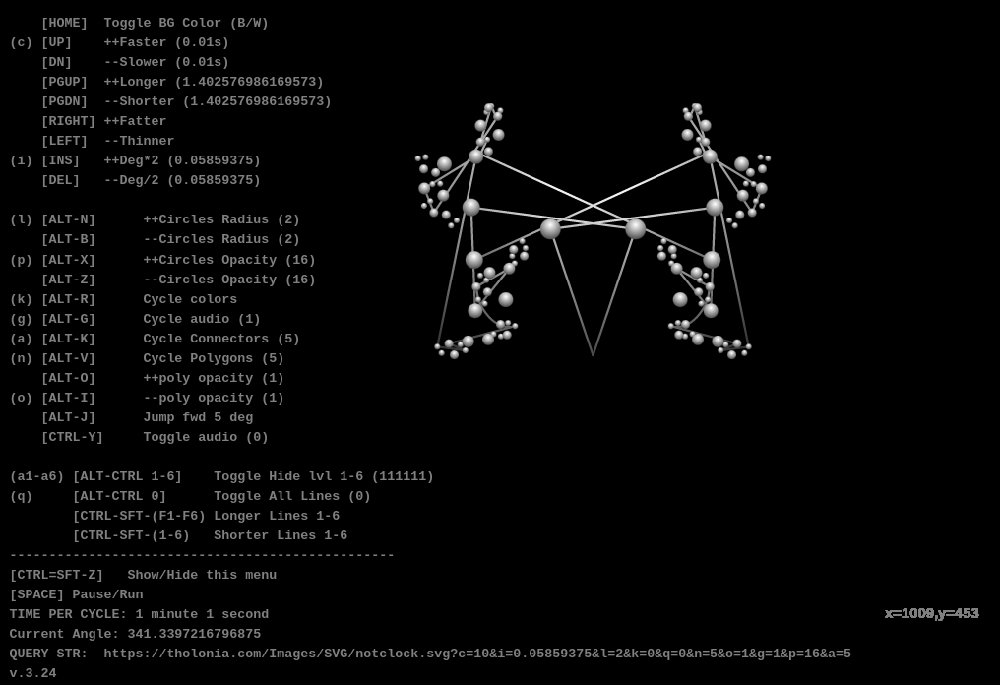

**notclock.svg** is an interactive, real-time animation SVG based in a 6-generation bifurcated point (i.e., one point becomes 2 point, each of those point becomes 2 points, etc., 6 times).  This is the basic model used to describe “Tholonic Expansion”, which describe the models of nature and energy, and this SVG was initially designed to be a clock based on this concept, but that seemingly simple idea tuned out to be far more challenging than imagined, so that code turned into this, which is not a clock.

It uses no external links and requires no internet connection.  All the data, such as the MP3 files of piano keys, are embedded into the file.  These files in constantly being updated, so what is stated here may not be exactly accurate at times.  This document is accurate to version 3.24.

The four main files are:

- `clock_1.svg`
  - The ‘main’ part of the SVG

- `clock_1_lib.js`
  - Functions and some vars

- `clock_1_listeners.js`
  - Event handlers

- `clock_1_merge.py`
  - Python script to merge the three files into one file called `notclock.svg`

The files have been broken up in three parts to make editing easier.

Because editors use the file extensions to know how to parse the data, editing a file as an SVG is a pain as I have yet to find an editor that properly parses SVG.  To get around this, symlink `clock_1.svg` to `clock_1.svg.js` 

The latest version of this file is usually [here](https://tholonia.com/Images/SVG/notclock.svg).

Here some interesting configs (live links)

- [Basic Lines, fast](https://tholonia.com/Images/SVG/notclock.svg?c=10&i=0.234375&l=0&k=0&q=1&a1=1&a2=1&a3=1&a4=1&a5=1&a6=1&n=0&o=1&g=1&p=1&a=0)
- [Basic Lines w/ polygons](https://tholonia.com/Images/SVG/notclock.svg?c=10&i=0.0146484375&l=0&k=0&q=1&a1=1&a2=1&a3=1&a4=1&a5=1&a6=1&n=1&o=1&g=1&p=1&a=0)
- [Asymmetry](https://tholonia.com/Images/SVG/notclock.svg?c=1000&i=7.5&l=2&k=1&q=1&a1=0&a2=0&a3=1&a4=1&a5=1&a6=1&n=0&o=1&g=1&p=1&a=4)
- [Balls only](https://tholonia.com/Images/SVG/notclock.svg?c=10&i=0.0146484375&l=5&k=0&q=0&n=5&o=1&g=1&p=16&a=0)
- [Balls with Rays](https://tholonia.com/Images/SVG/notclock.svg?c=-2&i=0.003&l=2&k=1&a1=0&a2=0&a3=0&a4=0&a5=0&a6=0&n=1&o=0.04\)
- [Connected Balls](https://tholonia.com/Images/SVG/notclock.svg?c=-2&i=0.003&l=2&k=1&a1=0&a2=0&a3=0&a4=0&a5=0&a6=0&n=1&o=0.04\)

Some screenshots

### Key Commands
In the table below, the key command are symbolized as:

⌥ = ALT
^ = CTRL
⇧-SHIFT

The characters in brackets [] represent the HTML query string variable name that can used used for that feature.  For example, if you use the URL `notclock.svg?up=1000&de=7.5`, the app with start with the a loop-delay of 100ms and a degree increment of 7.5 degrees.

**HOME**   Toggle BG Color (B/W)   # *changes background color*
**UP** `[up]`    ++Faster             *Speeds up the loop.  Can be very CPU intensive*
**DN**                --Slower              *slows down the loop speed*
**PGUP**           ++Longer            *Makes all the lines longer*
**PGDN**           --Shorter             *Makes all the lines shorter*
**RIGHT**          ++Fatter             *Makes all the lines wider*
**LEFT**             --Thinner            *Makes all the lines thinner*
**INS** (i)            ++Deg\*2           *Doubles the degrees rotated per frame*
**DEL**                --Deg/2              *Half's the degrees rotated per frame*

**⌥ N** `[aN]`   ++Circles Radius      *Increases size of circles*
**⌥ B** `[aB]`    --Circles Radius        *Decreases size of circles*
**⌥ M** `[aD]`      Cycle circles         *Cycles though circle themes* 
**⌥ X** `[aX]`  ++Circles Opacity     *Increases density of sphere*
**⌥ Z** `[aZ]`   --Circles Opacity       *Increases translucency of circle*
**⌥ R** `[aR]`      Cycle colors          *Cycles thru various color themes*
**⌥ G** `[aG]`      Cycle audio           *Cycles thru various sound/music themes*
**⌥ U** `[aU]`      Cycle dataset         *Cycles though transformed datasets* (see note 1)
**⌥ A** `[aA]`      Cycle presets          *Cycles preset configs* (see note 2)
**⌥ C** `[aC]`      Cycle vars              *Cycles various variables through a continuous loop* (see note 3)

**⌥ K** `[aK]`      Cycle Connectors/Paths   *Connecting the points in various ways*
**⌥ V** `[aV]`      Cycle Polygons           *Cycling thru various polygons based on the data*
**⌥ O** `[aO]`    ++poly opacity            *Increases density of polygon*
**⌥ I** `[aI]`       --poly opacity             *Increases translucency of polygon*
**⌥ J**                      Jump fwd 5 deg     *Advance all diverging angles by 5 degrees*
**^ Y**                       Toggle audio           *Start sound system (requires manual initiation)*

**^⌥  1** `[ca1]`   *Toggle show/hide line 1*
**^⌥  2** `[ca2]`   *Toggle show/hide line 2*
**^⌥  3** `[ca3]`   *Toggle show/hide line 3*
**^⌥  4** `[ca4]`   *Toggle show/hide line 4*
**^⌥  5** `[ca5]`   *Toggle show/hide line 5*
**^⌥  6** `[ca6]`  *Toggle show/hide line 6*

**^⌥ 0**  `[ca0]` *Toggle show/hide all Lines*

**^⇧ F1**   *Shorten line 1*		**^⇧ 1**    *Lengthen Lines 1*
**^⇧ F2**   *Shorten line 2*		**^⇧ 2**    *Lengthen Lines 2*
**^⇧ F3**   *Shorten line 3*		**^⇧ 3**    *Lengthen Lines 3*
**^⇧ F4**   *Shorten line 4*		**^⇧ 4**    *Lengthen Lines 4*
**^⇧ F5**   *Shorten line 5*		**^⇧ 5**    *Lengthen Lines 5*
**^⇧ F6**   *Shorten line 6*		**^⇧ 6**    *Lengthen Lines 6*

Note 1:

Note 2:

Note 3: 

