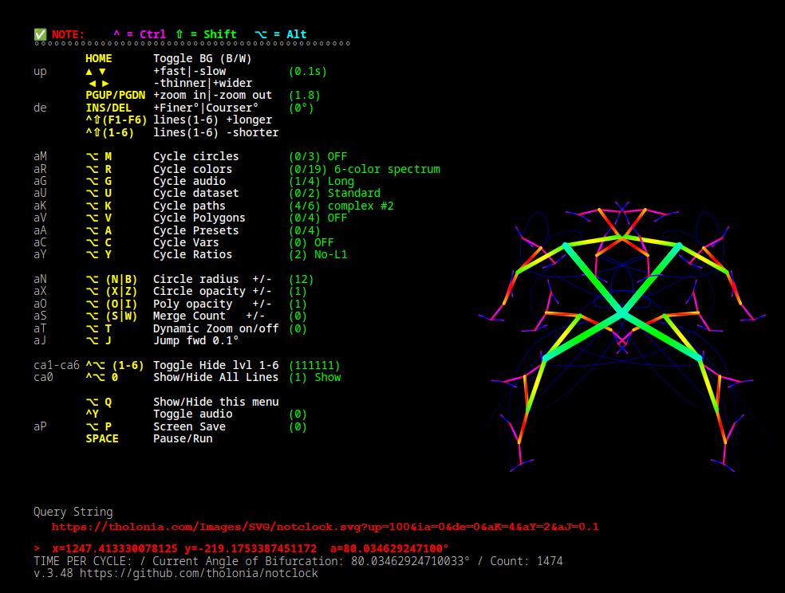
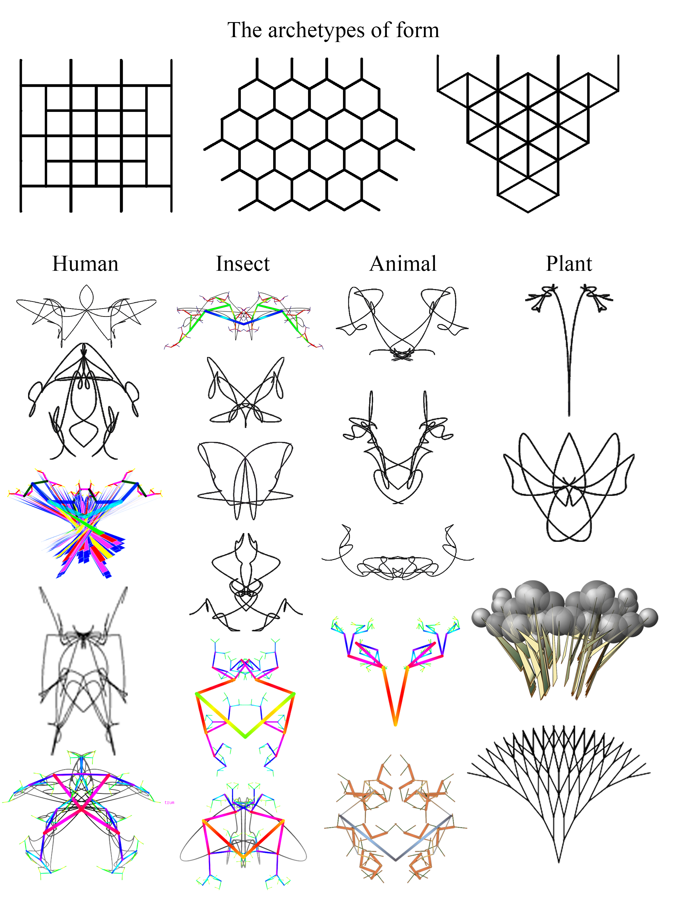

**notclock.svg** is an interactive, real-time animation SVG based in a 6-generation bifurcated point (i.e., one point becomes 2 point, each of those point becomes 2 points, etc., 6 times).  This is the basic model used to describe “Tholonic Expansion”, which describe the models of nature and energy, and this SVG was initially designed to be a clock based on this concept, but that seemingly simple idea tuned out to be far more challenging than imagined, so that code turned into this, which is not a clock.


It uses no external links and requires no internet connection.  All the data, such as the MP3 files of piano keys, are embedded into the file.  These files in constantly being updated, so what is stated here may not be exactly accurate at times.  This document is accurate to version 3.43.

The four main files are:

- `clock_1.svg`
  - The ‘main’ part of the SVG

- `clock_1_lib.js`
  - Functions and some vars

- `clock_1_listeners.js`
  - Event handlers

- `clock_1_data.js`
  - constants, globals, and large arrays

- `clock_1_merge.py`
  - Python script to merge the three files into one file called `notclock.svg`

- `sserver.py`
  - local server used to save each image as a screenshot. 

- `qscan.py`
  - utility to quickly browse/save a list of files in a directory.  The directories are hard-coded, so change to you liking.  Requires pythion modules for selenium, shutil, termcolor and Firefox.


The files have been broken up in three parts to make editing easier.

Because editors use the file extensions to know how to parse the data, editing a file as an SVG is a pain as I have yet to find an editor that properly parses SVG.  To get around this, symlink `clock_1.svg` to `clock_1.svg.js` 

The latest version of this file is usually [here](https://tholonia.com/Images/SVG/notclock.svg).

Here some interesting configs (live links)

- [Creates better individual images](https://tholonia.com/Images/SVG/notclock.svg?up=550&ia=287&aN=7&aR=16&aV=1&aX=0.7&aC=1&mF=-3&mT=1&aT=1)
- [Shows the changes as it moves, more like a continuous progression.  Also, more 'arty'](https://tholonia.com/Images/SVG/notclock.svg?up=50&ia=90&de=0.0019199029477404335&aR=17&aV=2&aT-1X=1.8&aK=1&aC=5&aM=1&aY=3&mF=3&ia=91.18759470549595)


Interface…



Some generated images…



### Key Commands
In the table below, the key command are symbolized as:

⌥ = ALT
^ = CTRL
⇧=SHIFT
⌘=Meta (sometimes doesn't work if conflicting with window manager. Untested in Windows)

The characters in brackets [] represent the HTML query string variable name that can used used for that feature.  For example, if you use the URL `notclock.svg?up=1000&de=7.5`, the app with start with the a loop-delay of 100ms and a degree increment of 7.5 degrees.

**HOME**   Toggle BG Color (B/W)   # *changes background color*
**UP** `[up]`    ++Faster             *Speeds up the loop.  Can be very CPU intensive*
**DN**                --Slower              *slows down the loop speed*
**PGUP**           ++Longer            *Makes all the lines longer*
**PGDN**           --Shorter             *Makes all the lines shorter*
**RIGHT**          ++Fatter             *Makes all the lines wider*
**LEFT**             --Thinner            *Makes all the lines thinner*
**INS** (i)            ++Deg               *Increases the degrees rotated per frame*
**DEL**                --Deg               *Reduces the degrees rotated per frame*

**⌥ N|B** `[aN]`   Circles Radius      *Increases/decrease size of circles*

**⌥ M** `[aM]`      Cycle circles         *Cycles though circle themes* 
**⌥ X|Z** `[aX]`  Circles Opacity     *Increases/decreases density of sphere*
**⌥ O|I** `[aO]`   Polygon Opacity     *Increases/decreases density of polygons*

**⌥ R** `[aR]`      Cycle colors          *Cycles thru various color themes*
**⌥ G** `[aG]`      Cycle audio           *Cycles thru various sound/music themes*
**⌥ U** `[aU]`      Cycle dataset         *Cycles though transformed datasets* <sup>(see note 1)</sup>
**⌥ A** `[aA]`      Cycle presets          *Cycles preset configs* <sup>(see note 2)</sup>
**⌥ C** `[aC]`      Cycle vars              *Cycles various variables through a continuous loop* <sup>(see note 3)</sup>
**⌥ Y** `[aY]`      Cycle ratios             *Cycles various relative length's of lines* <sup>(see note 6)</sup>
**⌘ F** `[mF]`      Cycle flowers          *Cycles various 'flowers' that extend from the ends pionts* <sup>(see note 7)</sup>
**⌘ T** `[mT]`      Cycle fruit              *Toggles on/off a randomly colored sphere on end points 

**⌥ K** `[aK]`      Cycle Connectors/Paths   *Connecting the points in various ways*
**⌥ V** `[aV]`      Cycle Polygons      *Cycling thru various polygons based on the data*
**⌥ O** `[aO]`    ++poly opacity         *Increases density of polygon*
**⌥ I** `[aI]`       --poly opacity         *Increases translucency of polygon*
**⌥ J**  `[aJ]`       Jump fwd n° deg     *Advance all diverging angles by 5 degrees*
**⌥ S|W**                  Merge count          *Increases/decreases number of images that can overlay
**^ Y**                       Toggle audio           *Start sound system (requires manual initiation)*

**^⌥  1** `[ca1]`   *Toggle show/hide line 1*
**^⌥  2** `[ca2]`   *Toggle show/hide line 2*
**^⌥  3** `[ca3]`   *Toggle show/hide line 3*
**^⌥  4** `[ca4]`   *Toggle show/hide line 4*
**^⌥  5** `[ca5]`   *Toggle show/hide line 5*
**^⌥  6** `[ca6]`  *Toggle show/hide line 6*
**^⌥ 0**  `[ca0]` *Toggle show/hide all Lines*

**^⇧ F1**   *Shorten line 1*		**^⇧ 1**    *Lengthen Lines 1*
**^⇧ F2**   *Shorten line 2*		**^⇧ 2**    *Lengthen Lines 2*
**^⇧ F3**   *Shorten line 3*		**^⇧ 3**    *Lengthen Lines 3*
**^⇧ F4**   *Shorten line 4*		**^⇧ 4**    *Lengthen Lines 4*
**^⇧ F5**   *Shorten line 5*		**^⇧ 5**    *Lengthen Lines 5*
**^⇧ F6**   *Shorten line 6*		**^⇧ 6**    *Lengthen Lines 6*

**⌥ Q** `[FS]`    *Show/hide screen menu*
**⌥ P**  `[aP]`   *Screensave*  <sup>(see note 4)</sup>
**SPACE**               *Pause/Run*     Pause program for 10000 seconds 
**⌥ T**  `[aT]`   *Dynamic zoom*  Automatically zooms viewbox to maximize image, <sup>(see note 5)</sup>

The following query parameters are only available for use by adding them manually to the URL.

```xA=1``` 
- Cycles through preexisting presets of configurations.  Currently only 5 and not all that interesting.  This is similar to ```aA=1``` which cycles through present on command, but ```xA=1``` cycles automatically.

```FS=1```
- Open without menu.  The menu can be reopened with **⌥ Q**

```ia=-1|0-360```
- Sets the starting angle of divergence.  `-1` uses the seconds of the epoch to set the angle.

```li=0|1```
- 'line mode', overrides PATH attributes to allows for white, relatively ungradiated, thicker lines.  Used for viewing PATH lines only.

```ma=0|1```
- Use angle of mouse (relative to center) as the branch_angle. In auto-zoomed mode, these coordinates will bounce around.

```de=n```
- set the deg adjustment.  `ma=1` override this.


## Notes
`x=nnn, y=xxx , a=aaa.aaaa`
- Mouse coordinates and angle of mouse relative to 0,0 within the `viewbox`, NOT screen.  The angle reported in adjusted for convie4nience, as the actual 0° pont is at the rightmost part opf the circle.

`Query String`
- This is the complete URL that will all the current display options. To copy this, first PAUSE the app, then highlight and copy with mouse.  If you do not PAUSE, the selected area gets erased on refresh.

`TIME PER CYCLE`
- A rough estimate as to how long before the current cycle begins to *generally* repeat, i.e., when the first generation line has made a complete cycle.   Given the various options, exact repetition can take many, many years to replicate.   I stopped calculating that value after it extended past 17 years.

`Current Angle`
- The bifurcation angle of all the generations.

***Note 1***: Some of these datasets look boring or ugly, depending on the on the context, like [this](https://tholonia.com/Images/SVG/notclock.svg??up=1000&de=57.29577951308232&aN=0&aR=0&aV=0&aO=1&aG=1&aX=1&aK=0&aU=2&aA=0&aC=0&aM=0&aS=0), for example.  But if you hide the lines, and add some spheres, it likes quite different and certainly more interesting, like [this](https://tholonia.com/Images/SVG/notclock.svg??up=1000&de=57.29577951308232&aN=14&aR=0&a0=0&aV=0&aO=1&aG=1&aX=1&aK=0&aU=2&aA=0&aC=0&aM=1&aS=0).

***Note 2***: Current presets are tests only.

***Note 3:*** This automatically cycles the following variables: circle radius, circle opacity, pen-size of each line, line length of each line, and through the arrays of themes for circles, paths, polygons, datasets, and color spectrums.  Tapping **⌥ C** once cycle all variables.  Tapping **⌥ C** again turn off polygons.  Tapping **⌥ C** a third time, turn off all variable changes, but keeps whatever the last setting were.

***Note 4:***   In the SVG code, there is a call to a websocket server, `sserver.py`, which then makes a screenshot for every image.  To enable this feature, the server must be running BEFORE the app is started.  On my machine, screenshots were limited to 1 screenshot per 0.4 seconds.  

***Note 5:*** As dynamic zoom adjusts the viewbox for every frame, and as the image limits change every frame, there is always some jitter between frames.  For SVG 'paths', the image may extend out-of-frame as the x,y values are being dynamically generated when creating Bezier curves.

***Note 6:*** These rations are: Platinum mean (1), Golden mean (1.618), Removal of line #1, prime numbers (5,7,11,13,17,23), alternate gold/silver mean (1.617, 1,414), incremental (123456), decremental (654321), √2÷2 (0.707), bi-ncremental (135246).


## Tips
To have a image that only moves according to the mouse position, add the query parameters `up=100&ma=1&ia=0&de=0`.  This will update the screen 10 times a second (`up=100`), start at 0° (`ia=0`), and automatically advance by 0° (`de=0`).  

## Current Options

**Colors**

- 7-color spectrum, shifted 7-color, random 7-color, tholo1, tholo, David Hockney, Van Gogh, Rembrandt, Picasso, Hopper, Monet, Carravaggio, Corn, Sunset, Pastel, Vintage, Explosion, psychedelic

**Circles**

- none, white, palette, random

**Datasets**

- Standard, Bez Parallel, Bez Serial

**Paths**

- none, True-open, True-closed, complex #1, complex #2, complex #4, super complex

**Polys**

- none, cos/sin-10, CiR(cos\*sin)-10, DeltasCos(rot)

**Audios**

- none, Long, Short, Piano, Long+Short

**Vars**

- none, All, No-poly, No color change

## Bugs

- Tracking column in menu often might display wrong numbers.
- In merge/overlay mode, strings on the menu screen overwrite themselves, so if the string changes, such as the query string, it’s unreadable.  However, Copying the string copies the current and last version.
